<div align="center">
  
# 🌍 Global Reserve Unit (GRU)
## Official Monetary Policy Documentation

[](https://github.com/Defi-Oracle-Tooling/GRU-Official-Docs-Monetary-Policies/actions)
[](https://creativecommons.org/licenses/by/4.0/)
[](#core-documents-overview)
[](#smart-contract-architecture)

<br/>

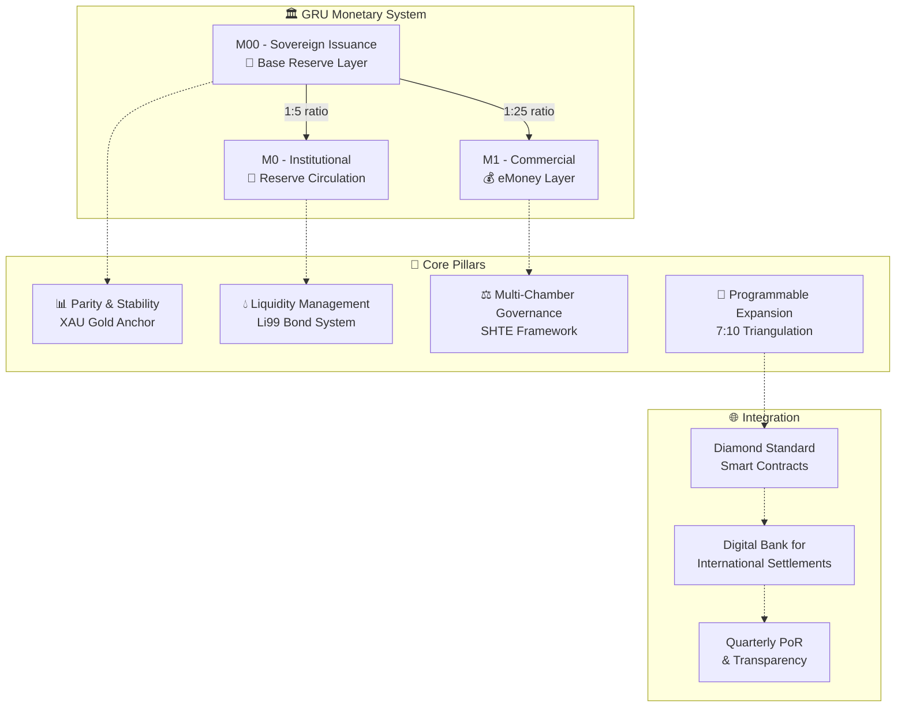

---

### 🎯 **Repository Purpose**

This repository contains the **comprehensive institutional documentation** for the **Global Reserve Unit (GRU)** monetary architecture and **Digital Bank for International Settlements (DBIS)** charter. It establishes the foundation for:

- 📋 **Core Policy Framework** - Structural ratios, reserve policies, governance layers
- ⚙️ **Mechanical Issuance Logic** - Atomic triangulation, 7:10 protocol, 40/40/20 allocation
- 🏛️ **Governance Infrastructure** - Multi-chamber SHTE oversight and compliance
- 📈 **Bond System Management** - Li99-series liquidity instruments and cycles
- 🚀 **Expansion Roadmap** - Phased rollout and future enhancements

</div>

## 📁 Repository Architecture

<div align="center">

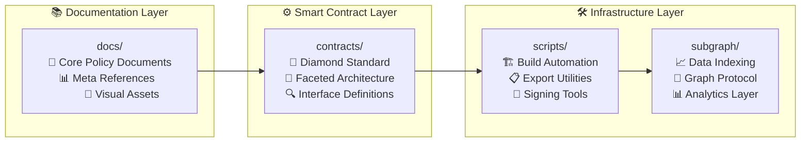

</div>

### 🗂️ **Directory Structure**
```
📁 docs/
├── 📋 core/                    # Primary white paper documents
│   ├── 📄 00_GRU_Executive_Summary.md
│   ├── 📊 01_GRU_Monetary_Policy_Framework.md
│   ├── 🔄 02_GRU_Triangulation_eMoney_Creation.md
│   ├── 💰 03_GRU_Bond_System_Liquidity_Management.md
│   ├── ⚖️ 04_GRU_Governance_Regulatory_Oversight.md
│   ├── 🌐 05_Digital_Bank_for_International_Settlements_Charter.md
│   ├── 🚀 06_GRU_Enhancement_Expansion_Roadmap.md
│   └── 🏛️ 07_OMNL_Central_Bank_DBIS_Operational_Manual.md
│
├── 🏛️ compliance/              # EU/ECB regulatory compliance
│   ├── 📋 sepa/               # SEPA payments compliance
│   │   ├── SEPA_Compliance_Matrix.md
│   │   └── IPR_Compliance_Memo.md
│   ├── ⚖️ mica/               # Markets in Crypto-Assets regulation
│   │   ├── Legal_Position_GRU_vs_MiCA.md
│   │   └── Issuer_Obligations_Readiness.md
│   ├── 🛡️ dora/               # Digital Operational Resilience Act
│   │   ├── ICT_Risk_Policy.md
│   │   ├── Incident_Response_Runbook.md
│   │   ├── Third_Party_Risk_Policy.md
│   │   ├── BCP_DR_Plan.md
│   │   └── Annual_Test_Plan.md
│   ├── 🔍 aml/                # Anti-Money Laundering & CFT
│   │   ├── Enterprise_Wide_Risk_Assessment.md
│   │   ├── KYC_SOP.md
│   │   ├── Sanctions_Screening_SOP.md
│   │   ├── TM_Scenarios.md
│   │   ├── SAR_Playbook.md
│   │   └── Training_Log.md
│   └── 🔐 gdpr/               # Data protection compliance
│       ├── DPIA_GRU.pdf
│       └── Record_of_Processing_Activities.md
│
├── 🔗 integration/             # Technical integration documentation
│   └── iso20022/              # ISO 20022 message standards
│       ├── pain.001.sample.xml
│       ├── pacs.008.sample.xml
│       └── Mapping_Table.md
│
├── 📊 disclosures/             # Transparency and public disclosures
│   └── PoR_Methodology.md     # Proof-of-Reserves framework
│
├── 🔒 security/                # Security and risk management
│   └── Oracle_Governance_Standard.md
│
├── 💼 finance/                 # Financial controls and accounting
│   ├── Accounting_Policy_IFRS.md
│   └── Monthly_Close_Checklist.md
│
├── ⚖️ legal/                   # Legal and documentary controls
│   └── Documentary_Controls_ICC_Style.md
│
├── 📖 meta/                    # Supporting references & annexes
│   ├── 🧮 GRU_Formulas.md
│   ├── 📚 Glossary.md
│   ├── ⚠️ Risk_Annex.md
│   └── 🎨 preamble.tex         # LaTeX PDF styling
│
└── 🎨 media/                   # Visual diagrams & assets
    ├── 🔄 issuance_cycle.svg
    ├── 📐 triangulation_flow.svg
    ├── 🏛️ governance_chambers.svg
    ├── 💎 bond_cycle.svg
    └── 📊 velocity_metrics.svg

💎 contracts/                   # Diamond Standard smart contracts
├── 🏗️ GrcDiamond.sol          # Main diamond contract
├── 🔧 facets/                 # Modular functionality facets
├── 🔗 interfaces/             # Interface definitions
└── 📚 libraries/              # Shared contract libraries

🛠️ scripts/                    # Build & automation tools
📈 subgraph/                   # Graph Protocol indexing
📦 dist/                       # Generated artifacts (gitignored)
```

## 📋 Core Documents Overview

<div align="center">

| 📄 Document | 🎯 Scope | 📊 Status | 🔗 Key Features |
|-------------|---------|-----------|----------------|
| **00_Executive_Summary** | 🌍 High-level orientation & pillar mapping |  | Quick ratios, strategic objectives |
| **01_Monetary_Policy_Framework** | 📊 Structural ratios & governance layers |  | XAU anchor, M00/M0/M1 layers |
| **02_Triangulation_eMoney_Creation** | 🔄 Atomic issuance & expansion protocol |  | 7:10 protocol, 40/40/20 rule |
| **03_Bond_System_Liquidity_Management** | 💰 Li99-series bonds & liquidity cycles |  | Coupon flows, buy-back cycles |
| **04_Governance_Regulatory_Oversight** | ⚖️ Multi-chamber SHTE governance |  | 5-chamber structure, compliance |
| **05_Digital_Bank_International_Settlements** | 🌐 DBIS treaty-style charter |  | Cross-border integration |
| **06_Enhancement_Expansion_Roadmap** | 🚀 Phase rollout & future evolution |  | M2/M3 aggregates, enhancements |
| **07_OMNL_Central_Bank_DBIS_Operational_Manual** | 🏛️ Operational policy & transaction flows |  | Monetary structure, compliance matrix, transaction processes |

</div>

### 💎 **Smart Contract Architecture**

The GRU system implements the **Diamond Standard (EIP-2535)** for maximum flexibility and upgradeability:

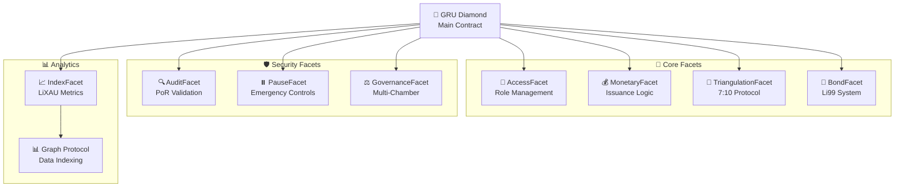

## 🏗️ Build & Packaging System

<div align="center">

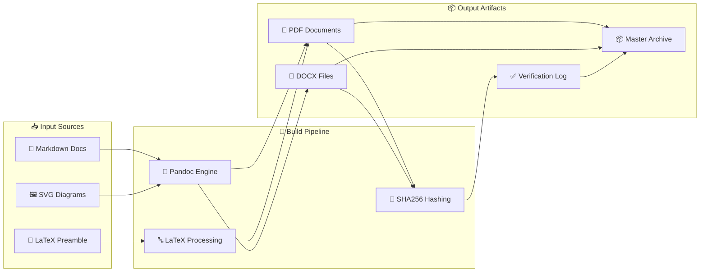

</div>

### 🛠️ **Prerequisites**
```bash
# Core dependencies
pandoc              # Document conversion engine
texlive-xetex       # LaTeX with Unicode support  
librsvg2-bin        # SVG to PDF conversion
zip                 # Archive creation
sha256sum           # Integrity verification
```

### 🚀 **Quick Start Build**
```bash
# Make build script executable and run
chmod +x scripts/build.sh && ./scripts/build.sh
```

### 📦 **Generated Artifacts**
```
dist/
├── 📄 markdown/                      # Source copies + master collection
├── 📖 pdf/                           # PDF conversions (multi-format)
├── 📝 docx/                          # DOCX conversions (Office compatible)
├── 🔍 metadata/                      # Checksum logs & build info
└── 📦 GRU_Master_Whitepaper_PRO.zip  # Complete archive bundle
```

> 💡 **Smart Fallback**: If `pandoc` is unavailable, the build gracefully generates markdown + checksums only, with detailed warnings in `dist/metadata/pandoc_missing.txt`

### 🎨 **Professional Styling System**
The build pipeline leverages `docs/meta/preamble.tex` for consistent, professional typography:
- 📏 **Geometry**: Optimal page layouts and margins
- 🎨 **Color Scheme**: GRU-branded visual identity  
- 📊 **Formula Boxes**: Highlighted mathematical expressions
- 📑 **Headers/Footers**: Document navigation and branding

### 🖼️ **Visual Diagram Library**

<div align="center">

| 🎨 Diagram | 📋 Purpose | 🔗 Usage Context |
|-----------|---------|----------------|
| `issuance_cycle.svg` | 🔄 **Reserve → Issuance → Circulation** | Monetary policy flow visualization |
| `triangulation_flow.svg` | 📐 **7:10 Protocol & Controls** | Atomic issuance mechanism |
| `governance_chambers.svg` | 🏛️ **Multi-Chamber SHTE** | Governance structure & oversight |
| `bond_cycle.svg` | 💎 **Li99 Bond Mechanics** | Coupon accrual → escrow → buy-back |
| `velocity_metrics.svg` | 📊 **Composite Velocity Index** | v_raw, v_adj, v_cov metrics |

</div>

> 🔄 **Dynamic Conversion**: SVG diagrams are automatically converted to PDF during build for seamless LaTeX embedding

### 📚 **Master Collection Assembly**
```mermaid
graph LR
    EXEC["📄 00_Executive_Summary"]
    POLICY["📊 01_Monetary_Policy"] 
    TRIANGULATION["🔄 02_Triangulation"]
    BONDS["💰 03_Bond_System"]
    GOVERNANCE["⚖️ 04_Governance"]
    DBIS["🌐 05_DBIS_Charter"]
    ROADMAP["🚀 06_Roadmap"]
    
    EXEC --> POLICY
    POLICY --> TRIANGULATION  
    TRIANGULATION --> BONDS
    BONDS --> GOVERNANCE
    GOVERNANCE --> DBIS
    DBIS --> ROADMAP
    
    ROADMAP --> MASTER["📖 Master Collection<br/>Single Unified Document"]
```

## 🔐 Integrity & Security Verification

<div align="center">

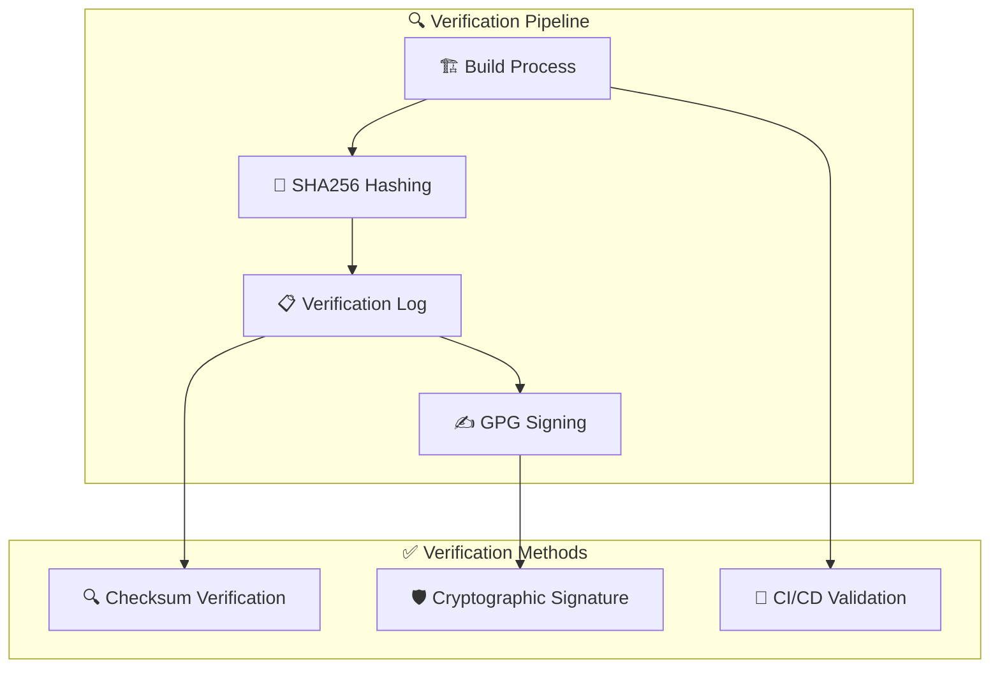

</div>

### 🔍 **Checksum Verification**
```bash
# Verify all document integrity
cd dist && sha256sum -c metadata/GRU_Checksum_Verification_Log.txt

# Expected output: All files report "OK"
# Any mismatch indicates potential tampering
```

### 🛡️ **GPG Signature Verification** 
```bash  
# Verify cryptographic signature (if available)
gpg --verify dist/metadata/GRU_Checksum_Verification_Log.txt.asc

# Import public key for verification
gpg --import gru-public-key.asc
```

## 🏷️ Versioning & Release Management

<div align="center">

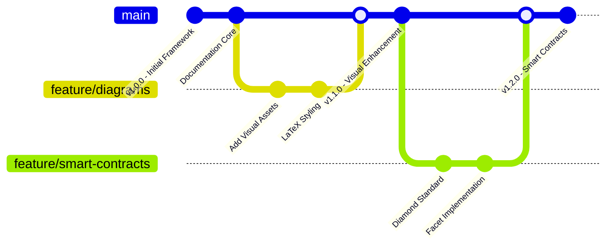

</div>

### 🚀 **Release Process**
```bash
# 1. Validate build integrity
./scripts/build.sh && echo "✅ Build successful"

# 2. Commit and tag release  
git add . && git commit -m "docs: prepare v1.x.x release"
git tag -a v1.x.x -m "GRU Documentation Release v1.x.x"

# 3. Trigger automated CI/CD
git push origin main --tags
```

### 📋 **Version Schema**
- `v1.0.x` - Core documentation framework
- `v1.1.x` - Visual enhancements & diagrams  
- `v1.2.x` - Smart contract integration
- `v2.0.x` - Major architecture updates

---

## 📜 Licensing & Attribution

<div align="center">

[](https://creativecommons.org/licenses/by/4.0/)

**Creative Commons Attribution 4.0 International (CC BY 4.0)**

</div>

This work is licensed under a Creative Commons Attribution 4.0 International License. You are free to:

- ✅ **Share** — copy and redistribute the material in any medium or format
- ✅ **Adapt** — remix, transform, and build upon the material
- ✅ **Commercial Use** — use the material for any purpose, even commercially

**Attribution Required**: Please credit "GRU Monetary Authority" when using or deriving from this work.

## 🗺️ Development Roadmap

<div align="center">

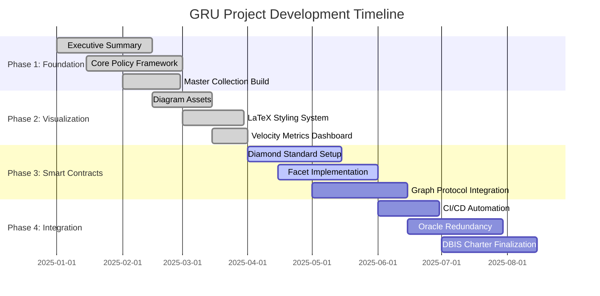

</div>

### ✅ **Completed Milestones**
- [x] 📄 **Executive Summary** - High-level framework orientation
- [x] 🏗️ **Master Collection** - Automated document aggregation  
- [x] 🎨 **Visual Assets** - Complete diagram library (issuance, triangulation, governance)
- [x] 💎 **Bond Cycle** - Li99 system visualization + velocity metrics
- [x] 📚 **Extended Glossary** - ESG alignment, oracle taxonomy, settlement definitions
- [x] 💎 **Diamond Standard** - Modular smart contract architecture
- [x] 📊 **Graph Protocol** - Blockchain data indexing and analytics

### 🚧 **In Progress**
[x] 🔐 **CI Signing** - Automated GPG key management for releases
[ ] 🌐 **Oracle Network** - Multi-source redundancy specification *(single-feed foundation live in companion; redundancy + aggregation pending)*
[ ] 📋 **Compliance Suite** - Automated regulatory reporting tools *(interfaces & stub facet added; enforcement/storage pending)*
[x] 🔍 **Audit Framework** - Quarterly PoR validation system

## 🔗 Companion Integration
The separate repository **GREM-GRU-eMoney-Companion** supplies execution-layer components (multi-asset controller, oracle interfaces, compliance & reporting abstractions) that extend this policy framework.

| Item | This Repo Status | Companion Capabilities | Next Step |
|------|------------------|------------------------|-----------|
| CI Signing | Implemented (GPG in CI) | N/A | Cross-sign PoR bundle |
| Oracle Network | Pending redundancy | Multiple mock feeds (USD/EUR/XAU) + deviation logic | Add `OracleAggregatorFacet` logic & median calc |
| Compliance Suite | Stub facet only | Interfaces for KYC/AML/jurisdiction & velocity | Implement storage + execution gates |
| Audit Framework | Implemented (PoR) | Structured reporting interface (`IReporting`) | Bundle signed PoR + compliance snapshot |

New stub facets introduced:
- `ComplianceFacet.sol` – role-gated placeholders for KYC/AML functions (currently revert `ErrNotReady`).
- `OracleAggregatorFacet.sol` – median price query placeholder (returns zero; mutators revert `ErrNotReady`).

See `docs/meta/Companion_Integration.md` for detailed integration roadmap (oracle redundancy phases, compliance gating plan, signing enhancements).

## 🤝 Contribution Guidelines

<div align="center">

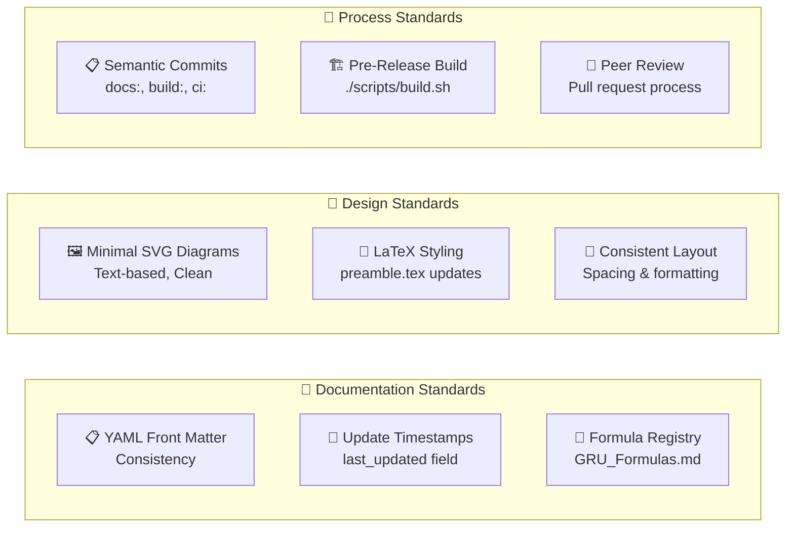

</div>

### 📋 **Documentation Standards**
1. **📄 Front Matter**: Maintain YAML consistency (title, version, status, last_updated, checksum)
2. **📅 Timestamps**: Update `last_updated` field for substantial content changes
3. **🧮 Formula Registry**: Add new equations to `GRU_Formulas.md` with proper documentation
4. **🔗 Cross-References**: Use consistent linking format across documents

### 🎨 **Design & Visual Standards**  
5. **🖼️ SVG Diagrams**: Keep minimal, text-based design for readable git diffs
6. **📐 Consistent Layout**: Avoid unnecessary reformatting of unrelated sections
7. **🎨 Style Guide**: Follow established LaTeX preamble styling conventions

### 🔄 **Development Process**
8. **📋 Semantic Commits**: Use conventional commit format (`docs:`, `build:`, `ci:`, `security:`)
9. **🏗️ Pre-Release Validation**: Run build script before tagging releases
10. **👀 Code Review**: Submit changes via pull request for collaborative review

### 🏆 **Quality Checklist**
```bash
# Pre-contribution validation
□ Front matter properly formatted
□ Timestamps updated where applicable  
□ Build script runs successfully
□ Diagrams optimized for version control
□ Semantic commit message used
□ Documentation cross-references verified
```

## 🔍 Transparency & Integrity Framework

<div align="center">

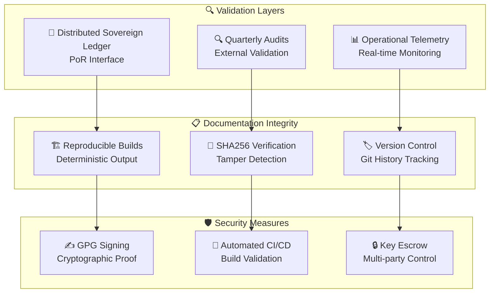

</div>

### 🔐 **Integrity Commitments**
- **📊 Reserve Modeling**: External validation via planned DSL Proof-of-Reserves interface
- **⚠️ Risk Assessment**: Provisional thresholds calibrated by operational telemetry post-deployment
- **🏗️ Build Stability**: YAML front matter processing + pre-converted SVG→PDF for reliable LaTeX embedding
- **🔍 Transparency**: All build processes are reproducible and publicly auditable

### 🌍 **Global Standards Alignment**
- **🏛️ BIS Compatibility**: Designed for integration with Bank for International Settlements frameworks
- **⚖️ Regulatory Compliance**: Multi-jurisdictional governance model supports diverse regulatory environments  
- **🌐 Cross-Border Settlement**: DBIS charter enables seamless international monetary coordination
- **📊 ESG Integration**: Environmental, Social, and Governance factors embedded in LiXAU composite indices

---

## 👥 Governance & Stewardship

<div align="center">

**🏛️ Primary Stewardship**  
**GRU Monetary Authority** — Policy & Systems Division

| 🏢 Division | 🎯 Responsibility | 📧 Contact |
|------------|------------------|-----------|
| **Policy & Systems** | Core framework development & maintenance | `policy@gru-authority.org` |
| **Technical Architecture** | Smart contract & infrastructure oversight | `technical@gru-authority.org` |  
| **Compliance & Audit** | Regulatory alignment & transparency | `compliance@gru-authority.org` |
| **Community Relations** | Documentation & developer engagement | `community@gru-authority.org` |

</div>

## 🔄 Automated CI/CD Pipeline

<div align="center">

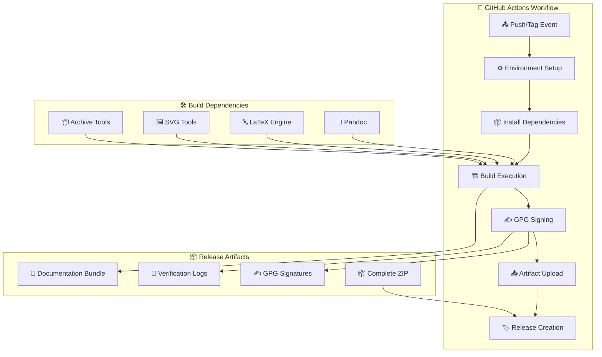

</div>

### ⚙️ **Automated Workflow** (`.github/workflows/build.yml`)
The CI/CD pipeline triggers on every push and tag, executing:

1. **🏗️ Environment Setup** - Ubuntu latest with caching optimization
2. **📦 Dependency Installation** - `pandoc`, `texlive-xetex`, `librsvg2-bin`, `zip`
3. **🔨 Build Execution** - `./scripts/build.sh` with full artifact generation
4. **✍️ Optional GPG Signing** - Cryptographic verification (requires secrets)
5. **📤 Artifact Publishing** - Upload to GitHub releases for tagged versions

### 🔐 **Manual GPG Signing Process**
```bash
# Import private signing key
gpg --import private.key
export GPG_KEY_ID="gru-authority@example.org"

# Execute signing script  
chmod +x scripts/sign_checksums.sh && ./scripts/sign_checksums.sh

# Verify signature integrity
gpg --verify dist/metadata/GRU_Checksum_Verification_Log.txt.asc \
               dist/metadata/GRU_Checksum_Verification_Log.txt
```

> 📋 **Release Protocol**: Include `.asc` signature files in all public releases for third-party verification

---

<div align="center">

## 🌟 Connect & Contribute

[](https://github.com/Defi-Oracle-Tooling/GRU-Official-Docs-Monetary-Policies/stargazers)
[](https://github.com/Defi-Oracle-Tooling/GRU-Official-Docs-Monetary-Policies/network/members)
[](https://github.com/Defi-Oracle-Tooling/GRU-Official-Docs-Monetary-Policies/issues)
[](https://github.com/Defi-Oracle-Tooling/GRU-Official-Docs-Monetary-Policies/pulls)

---

### 🔗 **Quick Links**
| 📖 **Core Documentation** | 🏛️ **Regulatory Compliance** | 💎 **Smart Contracts** | 🛠️ **Development** |
|---------------------------|----------------------------|------------------------|-------------------|
| [Executive Summary](docs/core/00_GRU_Executive_Summary.md) | [SEPA Compliance Matrix](docs/compliance/sepa/SEPA_Compliance_Matrix.md) | [Diamond Architecture](contracts/GrcDiamond.sol) | [Build System](scripts/build.sh) |
| [Policy Framework](docs/core/01_GRU_Monetary_Policy_Framework.md) | [MiCA Legal Position](docs/compliance/mica/Legal_Position_GRU_vs_MiCA.md) | [Monetary Facet](contracts/facets/MonetaryFacet.sol) | [CI/CD Pipeline](.github/workflows/build.yml) |
| [Governance & Oversight](docs/core/04_GRU_Governance_Regulatory_Oversight.md) | [DORA ICT Risk Policy](docs/compliance/dora/ICT_Risk_Policy.md) | [Graph Protocol](subgraph/schema.graphql) | [Contribution Guide](#-contribution-guidelines) |
| [Formula Reference](docs/meta/GRU_Formulas.md) | [AML Risk Assessment](docs/compliance/aml/Enterprise_Wide_Risk_Assessment.md) | [Oracle Governance](docs/security/Oracle_Governance_Standard.md) | [Compliance Artifacts](docs/compliance/) |

### 🏛️ **EU/ECB Compliance Dashboard**
| **Regulation** | **Status** | **Key Documents** | **Next Review** |
|----------------|------------|-------------------|-----------------|
| **SEPA/IPR** | ✅ Compliant | [Compliance Matrix](docs/compliance/sepa/SEPA_Compliance_Matrix.md) • [IPR Memo](docs/compliance/sepa/IPR_Compliance_Memo.md) | Q2 2025 |
| **MiCA** | ✅ Ready | [Legal Position](docs/compliance/mica/Legal_Position_GRU_vs_MiCA.md) • [Issuer Readiness](docs/compliance/mica/Issuer_Obligations_Readiness.md) | Q1 2025 |
| **DORA** | ✅ Implemented | [ICT Risk Policy](docs/compliance/dora/ICT_Risk_Policy.md) • [Incident Response](docs/compliance/dora/Incident_Response_Runbook.md) | Q2 2025 |
| **AML/CFT** | ✅ Compliant | [Enterprise Risk Assessment](docs/compliance/aml/Enterprise_Wide_Risk_Assessment.md) | Annual |
| **ISO 20022** | ✅ Implemented | [Message Mapping](docs/integration/iso20022/Mapping_Table.md) • [Sample Messages](docs/integration/iso20022/) | Q3 2025 |

---

**Built with ❤️ by the Global Reserve Unit Community**

© 2025 GRU Monetary Authority | Licensed under [CC BY 4.0](https://creativecommons.org/licenses/by/4.0/)

*Advancing transparent, programmable, and sustainable monetary policy for the digital age*

</div>