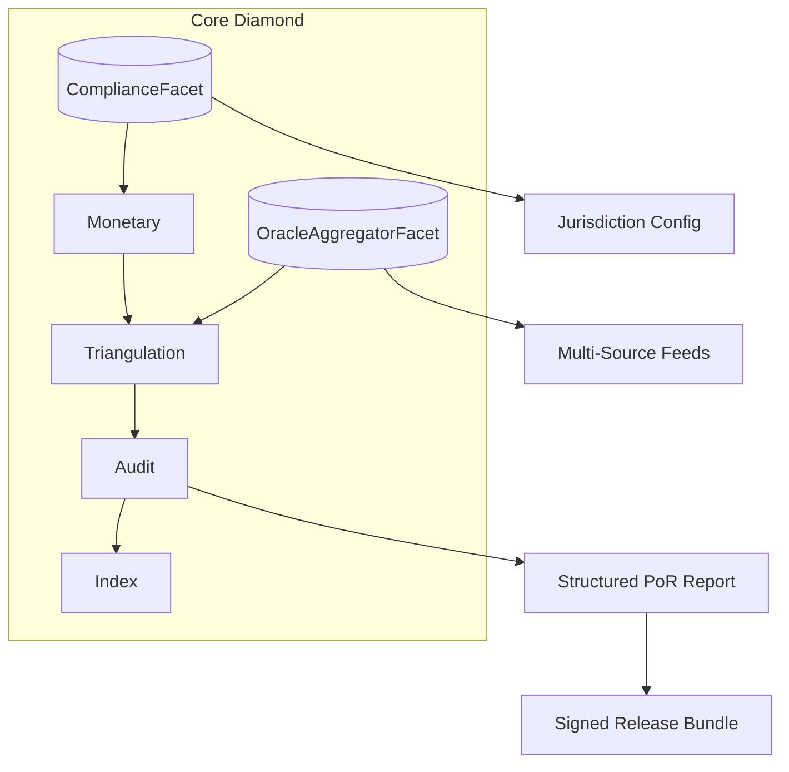

# Companion System Integration (GREM-GRU-eMoney-Companion)

## Purpose
This document describes how the **GREM-GRU eMoney Companion** repository extends and operationalizes roadmap items in this primary **GRU Monetary Policy Documentation** repository.

## Mapping Roadmap Items
| Roadmap Item | Current State | Companion Support | Next Step (This Repo) |
|--------------|---------------|-------------------|-----------------------|
| CI Signing | Implemented (GPG signing in CI) | N/A | Cross-sign PoR reports when integrated |
| Oracle Network | Single-source feeds only | Multiple mock price oracles (USD, EUR, XAU) + deviation logic | Add redundancy policy + on-chain aggregator facet |
| Compliance Suite | Interfaces only (no facet here) | Rich interfaces: KYC/AML, jurisdiction, velocity limits | Implement `ComplianceFacet` + bind role bits |
| Audit Framework | Implemented (PoR posting & sealing) | `IReporting.generatePoRReport` interface for structured reports | Integrate reporting output + signed release bundle |

## Oracle Redundancy Plan
1. Phase 0 – Single Feed (current): One trusted oracle per asset.
2. Phase 1 – Multi-Feed Registration: Allow registering ≥3 feeds per asset (Chainlink, internal, fallback). Store (price, timestamp, confidence).
3. Phase 2 – Aggregation Strategy: Median-of-fresh set; discard stale > heartbeat; if <2 fresh feeds → fallback to last median; log degradation event.
4. Phase 3 – Confidence Weighting: Weighted median by confidence bps.
5. Phase 4 – Cross-Asset Correlation Alerts (off-chain bot extension).

## Proposed `OracleAggregatorFacet`
Minimal interface:
```solidity
interface IOracleAggregatorFacet {
    struct Feed { uint256 price; uint64 ts; uint16 confidence; bool active; }
    event FeedRegistered(bytes32 assetId, address feed);
    event FeedUpdated(bytes32 assetId, address feed, uint256 price, uint64 ts, uint16 confidence);
    function registerFeed(bytes32 assetId, address feed) external;
    function updatePrice(bytes32 assetId, address feed, uint256 price, uint64 ts, uint16 confidence) external;
    function medianPrice(bytes32 assetId) external view returns (uint256 price, uint16 confidence, uint64 ts);
}
```
All functions initially revert `ErrNotReady()` until aggregation storage and validation rules are implemented.

## Compliance Suite Integration
The companion repo defines interfaces (`ICompliance`, `IReporting`, `IGrem`, `IOnRamp`) enabling:
- Address compliance profile management (KYC, AML risk tier)
- Jurisdiction configuration and emergency pauses
- Allowlist/blocklist enforcement
- Institutional velocity limits
- ISO 20022 message generation (planned)

### Planned `ComplianceFacet` (This Repo)
Responsibilities:
- Surface compliance checks on core flows (issuance, triangulation, redemption)
- Expose readonly views for governance dashboards
- Emit structured events for off-chain monitoring

Initial stub defers logic and reverts `ErrNotReady()` to avoid incomplete security assumptions.

## Integration Flow (Target)


## Security & Governance Considerations
- New role bits proposed:
  - `ROLE_COMPLIANCE_BIT = 1 << 4`
  - `ROLE_ORACLE_AGG_BIT = 1 << 5`
- Assignment via existing `AccessFacet` (not modified in this PR).
- Upgrades controlled by current governance timelock process (proposal encoding unchanged).

## Incremental Delivery Checklist
- [x] Documentation stub (this file)
- [x] Facet skeletons (placeholders)
- [ ] Implement feed storage + median logic
- [ ] Implement compliance profile storage
- [ ] Bind checks into monetary & triangulation flows
- [ ] Emit reporting bundle + signed artifact

## Next Steps
1. Add storage layout extensions separately (avoid collision with existing `GRCStorage`).
2. Implement oracle aggregation off-chain first for validation → mirror logic on-chain.
3. Introduce compliance execution gates with dry-run flag to measure false positives.
4. Extend release pipeline to sign PoR + compliance snapshot.

## Attribution
This integration layer conceptually bridges policy (this repo) and execution (Companion) without duplicating implementation logic.
