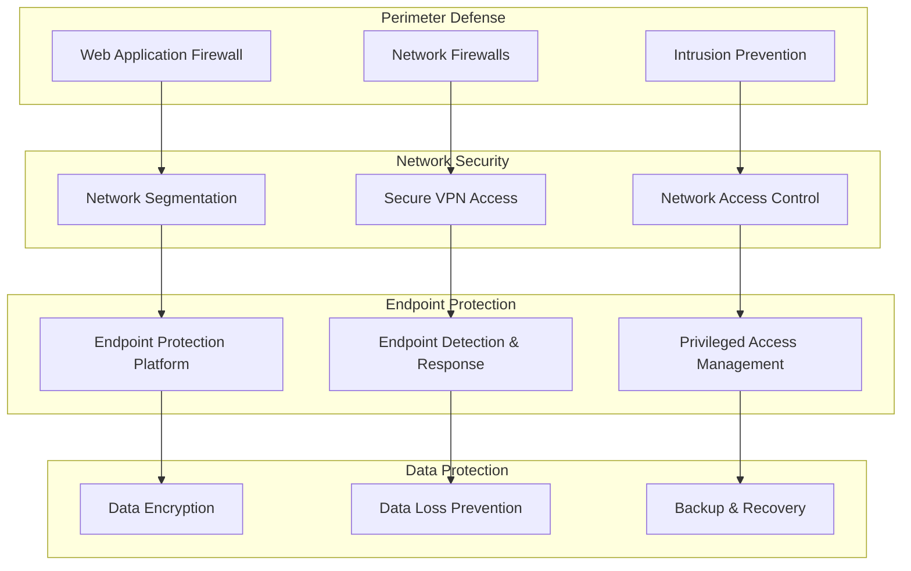

# ICT Risk Management Policy

## 1. Policy Statement and Scope

### 1.1 Policy Objectives
This ICT Risk Management Policy establishes the framework for identifying, assessing, and managing Information and Communication Technology (ICT) risks within GRU operations, in compliance with the Digital Operational Resilience Act (DORA) Regulation (EU) 2022/2554.

### 1.2 Scope of Application
This policy applies to:
- All GRU ICT systems, infrastructure, and digital services
- Third-party ICT service providers and cloud services  
- ICT-related business processes and operations
- All personnel with access to ICT systems
- Cross-border operations and digital payment rails

## 2. Regulatory Framework (Art. 5-15 DORA)

### 2.1 ICT Risk Management Requirements

| DORA Article | Requirement | GRU Implementation |
|-------------|-------------|-------------------|
| **Art. 5** | ICT Risk Management Framework | Comprehensive framework with board oversight |
| **Art. 6** | Risk Identification and Classification | Risk taxonomy with severity classification |
| **Art. 7** | Risk Assessment and Monitoring | Continuous monitoring with automated alerts |
| **Art. 8** | Risk Mitigation and Controls | Multi-layered security controls |
| **Art. 9** | Governance Arrangements | Three lines of defense model |

### 2.2 Board and Senior Management Responsibilities (Art. 5(2))

#### Board of Directors Responsibilities
- **Strategic Oversight**: Approve ICT risk appetite and strategy annually
- **Resource Allocation**: Ensure adequate resources for ICT risk management
- **Risk Culture**: Promote strong risk awareness across organization
- **Accountability**: Maintain ultimate accountability for ICT resilience

#### Executive Management Responsibilities  
- **Operational Management**: Implement board-approved risk framework
- **Risk Reporting**: Quarterly reporting to board on ICT risk profile
- **Incident Response**: Lead response to major ICT incidents
- **Continuous Improvement**: Drive enhancement of risk management capabilities

## 3. ICT Risk Governance Structure

### 3.1 Three Lines of Defense Model

```yaml
Risk_Governance_Structure:
  First_Line:
    Business_Units:
      - "Technology operations teams"
      - "Digital payment processing units"  
      - "Customer service platforms"
    Responsibilities:
      - "Day-to-day risk identification"
      - "Control implementation and monitoring"
      - "Incident detection and initial response"
      
  Second_Line:
    Risk_Functions:
      - "ICT Risk Management"
      - "Information Security"
      - "Compliance and Regulatory Affairs"
    Responsibilities:
      - "Risk framework development"
      - "Independent risk assessment"
      - "Policy development and monitoring"
      
  Third_Line:
    Internal_Audit:
      - "Independent assurance function"
    Responsibilities:
      - "Audit of risk management effectiveness"
      - "Validation of control design and operation"
      - "Board reporting on risk management maturity"
```

### 3.2 Committee Structure

| Committee | Frequency | Attendees | Key Responsibilities |
|-----------|-----------|-----------|-------------------|
| **Board Risk Committee** | Quarterly | Non-executive directors, CRO, CISO | Strategic oversight, risk appetite setting |
| **ICT Risk Committee** | Monthly | CTO, CRO, CISO, Business Heads | Operational risk management, incident review |
| **Technology Steering Committee** | Weekly | Technical leadership, Operations | Day-to-day risk monitoring, change approval |

## 4. ICT Risk Taxonomy and Classification

### 4.1 Risk Categories (Art. 6 DORA)

#### Primary Risk Categories
```yaml
ICT_Risk_Categories:
  Cyber_Security_Risks:
    - "External cyber attacks (DDoS, malware, APT)"
    - "Internal threats (privileged access abuse)"
    - "Data breaches and unauthorized access"
    - "Social engineering and phishing"
    
  Operational_Technology_Risks:
    - "System failures and outages"  
    - "Performance degradation"
    - "Integration and interoperability issues"
    - "Legacy system vulnerabilities"
    
  Third_Party_ICT_Risks:
    - "Cloud service provider failures"
    - "Critical vendor service disruptions"
    - "Supply chain compromises"
    - "Vendor security incidents"
    
  Data_Management_Risks:
    - "Data corruption or loss"
    - "Data privacy violations"
    - "Regulatory reporting failures"
    - "Business intelligence disruptions"
```

### 4.2 Risk Severity Classification

| Severity Level | Impact Criteria | Response Time | Escalation Required |
|----------------|----------------|---------------|-------------------|
| **Critical** | System-wide outage >4 hours OR data breach | 15 minutes | Board + Regulators |
| **High** | Service degradation >2 hours OR security incident | 30 minutes | Executive Committee |
| **Medium** | Limited service impact <2 hours | 2 hours | Department Head |
| **Low** | Minor operational impact | 24 hours | Team Manager |

## 5. Risk Assessment and Monitoring (Art. 7 DORA)

### 5.1 Risk Assessment Framework

#### Quantitative Risk Metrics
```yaml
Risk_Assessment_Methodology:
  Probability_Assessment:
    Very_High: ">30% annual probability"
    High: "10-30% annual probability"  
    Medium: "3-10% annual probability"
    Low: "1-3% annual probability"
    Very_Low: "<1% annual probability"
    
  Impact_Assessment:
    Catastrophic: ">€10M financial impact OR >24h outage"
    Major: "€1-10M financial impact OR 4-24h outage"
    Moderate: "€100K-1M financial impact OR 1-4h outage"
    Minor: "€10-100K financial impact OR <1h outage"
    Negligible: "<€10K financial impact OR <15min outage"
```

#### Risk Heat Map
| Impact/Probability | Very Low | Low | Medium | High | Very High |
|-------------------|----------|-----|---------|------|-----------|
| **Catastrophic** | Medium | High | High | Critical | Critical |
| **Major** | Low | Medium | High | High | Critical |
| **Moderate** | Low | Low | Medium | High | High |
| **Minor** | Very Low | Low | Low | Medium | Medium |
| **Negligible** | Very Low | Very Low | Low | Low | Medium |

### 5.2 Continuous Monitoring Program

#### Real-Time Monitoring Systems
| System Component | Monitoring Tool | Threshold Alerts | Response Protocol |
|-----------------|----------------|------------------|------------------|
| **Network Infrastructure** | SolarWinds NPM | Latency >100ms, Availability <99.9% | Network Operations Center |
| **Application Performance** | New Relic APM | Response time >2s, Error rate >1% | Application Support Team |
| **Security Events** | Splunk SIEM | Suspicious activity patterns | Security Operations Center |
| **Database Systems** | Oracle Enterprise Manager | Connection failures, Performance degradation | Database Administration |

#### Key Risk Indicators (KRIs)
```yaml
Key_Risk_Indicators:
  Availability_Metrics:
    System_Uptime: ">99.95% monthly"
    Critical_Service_Availability: ">99.99% monthly"
    Recovery_Time_Objective: "<4 hours"
    
  Security_Metrics:  
    Failed_Login_Attempts: "<1000 per day"
    Security_Incidents: "<5 per month"
    Vulnerability_Scan_Findings: "Critical: 0, High: <10"
    
  Performance_Metrics:
    Transaction_Processing_Time: "<2 seconds average"
    Peak_Load_Handling: "No degradation up to 150% normal volume"
    Data_Backup_Success_Rate: ">99.9%"
```

## 6. Risk Mitigation and Controls (Art. 8 DORA)

### 6.1 Control Framework

#### Technical Controls
| Control Category | Implementation | Validation Frequency | Responsible Team |
|-----------------|----------------|---------------------|------------------|
| **Access Management** | Multi-factor authentication, privileged access management | Weekly | Identity & Access Management |
| **Network Security** | Firewalls, intrusion detection, network segmentation | Daily | Network Security Team |
| **Endpoint Protection** | Antivirus, endpoint detection and response | Real-time | Endpoint Security Team |
| **Data Protection** | Encryption at rest and in transit, data loss prevention | Continuous | Data Protection Office |

#### Operational Controls  
```yaml
Operational_Controls:
  Change_Management:
    Process: "ITIL-based change management"
    Approval_Levels: "Risk-based approval matrix"
    Testing_Requirements: "Mandatory UAT and security testing"
    
  Business_Continuity:
    Recovery_Sites: "Primary (Frankfurt), Secondary (Amsterdam)"
    Backup_Strategy: "3-2-1 backup rule implementation"
    Disaster_Recovery_Testing: "Quarterly full DR tests"
    
  Vendor_Management:
    Due_Diligence: "ICT risk assessment for all critical vendors"
    Contract_Controls: "Security requirements and SLAs"
    Monitoring: "Continuous vendor performance monitoring"
```

### 6.2 Defense in Depth Strategy



## 7. Risk Reporting and Communication (Art. 9 DORA)

### 7.1 Reporting Framework

#### Management Reporting Schedule
| Report Type | Frequency | Recipients | Content Focus |
|-------------|-----------|------------|---------------|
| **Risk Dashboard** | Real-time | Operations Teams | KRI status, active incidents |
| **Weekly Risk Summary** | Weekly | Department Heads | Trend analysis, emerging risks |
| **Monthly Risk Report** | Monthly | Executive Committee | Risk profile changes, mitigation progress |
| **Quarterly Board Report** | Quarterly | Board of Directors | Strategic risk overview, regulatory compliance |

#### Regulatory Reporting
- **Annual ICT Risk Report**: Submitted to regulators per DORA Art. 28
- **Major Incident Notifications**: Within required timeframes per DORA Art. 19
- **Risk Assessment Updates**: Following material changes to risk profile

### 7.2 Risk Communication Protocols

#### Internal Communication
```yaml
Communication_Protocols:
  Risk_Escalation:
    Level_1: "Team Manager notification within 1 hour"
    Level_2: "Department Head notification within 2 hours"  
    Level_3: "Executive Committee notification within 4 hours"
    Level_4: "Board notification within 24 hours"
    
  Regular_Updates:
    Daily_Huddles: "Operational risk status updates"
    Weekly_Reviews: "Risk trend analysis and planning"
    Monthly_Forums: "Cross-departmental risk discussions"
```

## 8. Training and Awareness (Art. 13 DORA)

### 8.1 ICT Risk Training Program

| Training Module | Target Audience | Frequency | Delivery Method |
|----------------|----------------|-----------|-----------------|
| **ICT Risk Fundamentals** | All staff | Annual | E-learning + Workshop |
| **Cyber Security Awareness** | All staff | Quarterly | Interactive training |
| **Advanced Risk Management** | Risk personnel | Semi-annual | Professional certification |
| **Incident Response** | Response teams | Quarterly | Simulation exercises |

### 8.2 Competency Framework
- **Risk Identification**: Ability to recognize and classify ICT risks
- **Control Assessment**: Skills to evaluate control effectiveness  
- **Incident Management**: Capability to respond to and manage incidents
- **Regulatory Knowledge**: Understanding of DORA and related requirements

## 9. Policy Review and Updates

### 9.1 Review Schedule
- **Annual Review**: Comprehensive policy review and update
- **Regulatory Updates**: Review within 30 days of regulatory changes
- **Major Incidents**: Post-incident policy effectiveness review
- **Technology Changes**: Review following significant technology implementations

### 9.2 Approval and Version Control
- **Board Approval**: Required for material policy changes
- **Version Control**: Formal document management system
- **Communication**: Policy updates communicated to all relevant personnel
- **Training Updates**: Training materials updated following policy changes

---

**Document Control:**
- **Approved By**: Board of Directors  
- **Effective Date**: 2025-10-28
- **Classification**: Internal Use Only
- **Distribution**: All Personnel