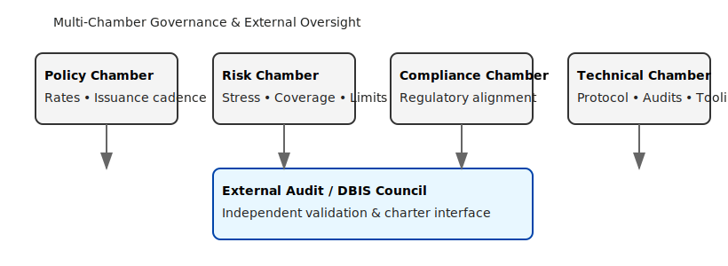

# GRU Governance & Regulatory Oversight Framework

## 1. Entity Model
The GRU operates under a Sovereign Hybrid Trust Entity (SHTE) combining trust law neutrality with multi-chamber institutional oversight.

## 2. Chambers
| Chamber | Scope | Core Outputs |
|---------|------|--------------|
| MPC (Monetary Policy) | Parity, issuance, expansion limits | Policy directives, parity adjustments |
| RAC (Reserve Audit) | Proof-of-Reserves & custody verification | Quarterly audit attestations |
| BSC (Bond Servicing) | Li99 cycles, coupon allocation | Bond cycle performance reports |
| TLC (Technology & Ledger) | DSL integrity, smart contract ops | Ledger upgrade proposals, security reviews |
| ECC (Ethics & Compliance) | AML/KYC, legal neutrality, conduct | Compliance certifications |

### Governance Structure Diagram

*Figure: Multi-chamber model with external audit / DBIS council integration.*

## 3. Oversight Principles
- Transparency: Real-time reserve + bond cycle stats
- Accountability: Segregated chamber authority w/ multi-sig approvals
- Integrity: Cryptographic anchoring of issuance & redemption events
- Resilience: Geographic and operational redundancy (multi-region custody)

## 4. Legal Recognition
- UNCITRAL framework alignment
- Arbitration seat: New York (primary); auxiliary hubs: Geneva, Singapore, Dubai
- Treated as PIMI (Private International Monetary Instrument)

## 5. Compliance Standards
| Area | Metric | Enforcement |
|------|-------|------------|
| Expansion | ≤ 2.75% annual net | MPC + ACP automated burns |
| Coverage | ≥ 120% reserves | RAC audits w/ DSL attestation |
| Parity Drift | ±2.5% threshold | MPAP activation |
| Bond Buy-back | ≤ 10-year cycle | BSC escrow validation |

## 6. Ethical Protocols
- Conflict-of-interest segregation (no cross-chamber executive overlap >40%)
- Whistleblower protected reporting channel (hashed submission proofs)
- Open-source publication of key smart contracts (transparency baseline)

## 7. Integration with Digital BIS (DBIS)
- MPC ↔ DBIS Monetary Council coordination
- RAC feeds DBIS Reserve Registry
- TLC enforces interoperability via ISO 20022 mapping & cross-ledger event adapters

## 8. Audit & Reporting Cadence
| Report | Frequency | Public | Verification |
|--------|----------|-------|-------------|
| PoR Snapshot | Quarterly | Yes | Independent auditor signatures |
| Bond Cycle Status | Quarterly | Partial | Escrow + coupon analytics |
| Annual Stability Review | Annually | Yes | Combined chamber endorsement |
| Parity Adjustment Bulletin | Ad hoc | Yes | MPC signed directive |

## 9. Risk Controls
| Risk | Control | Escalation |
|------|--------|-----------|
| Governance capture | Chamber independence, rotation schedule | Emergency oversight committee |
| Custody breach | Multi-sig vaulting, geo redundancy | Ledger freeze + incident IRP |
| Tech exploit | Formal verification of smart contracts | Patch release via TLC quorum |
| Compliance failure | Real-time rule engines, AML pattern detection | ECC remediation directive |

## 10. Future Governance Enhancements
- Tokenized governance attestations for public verification
- Automated policy simulation sandbox (impact forecasting)
- Cross-institution compliance oracle federation

## Summary
This governance framework ensures durable neutrality, transparency, and cryptographic trust, underpinning GRU as a reliable reserve and institutional settlement standard.
