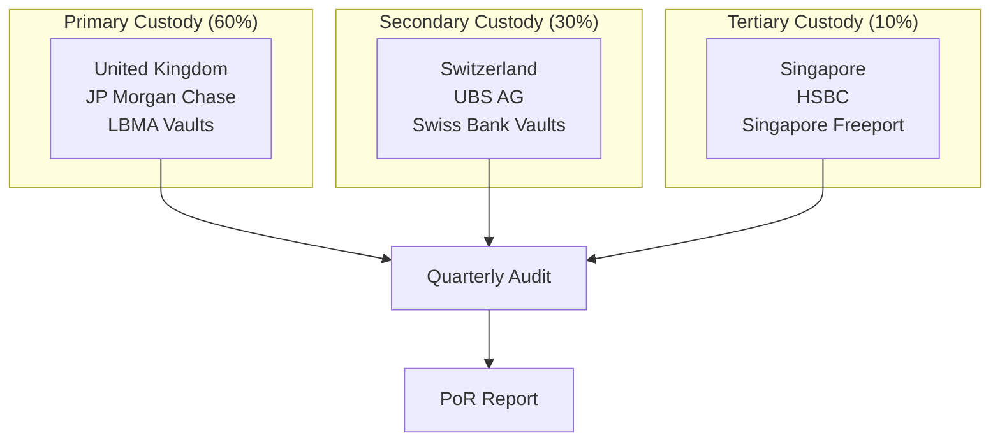
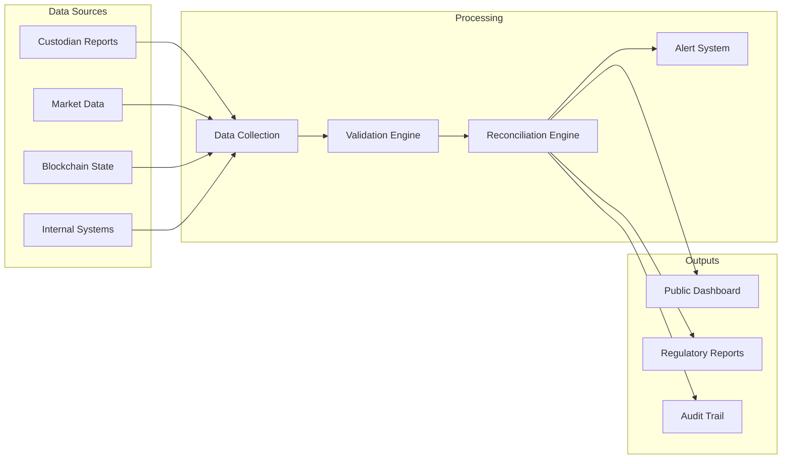

# Proof-of-Reserves Methodology and Attestation Framework

## Executive Summary

This document establishes the comprehensive methodology for Proof-of-Reserves (PoR) validation, transparency reporting, and independent attestation procedures for GRU reserve assets, ensuring regulatory compliance and maintaining public trust in the GRU monetary system.

## 1. Regulatory Framework and Objectives

### 1.1 Regulatory Requirements

| Regulation | Specific Requirement | GRU Implementation |
|------------|---------------------|-------------------|
| **MiCA Article 41** | Daily reserve composition disclosure | Real-time dashboard + daily reports |
| **MiCA Article 36** | Reserve backing requirements | 120% minimum coverage ratio |
| **DORA Article 17** | Operational resilience transparency | Quarterly resilience attestation |
| **4th/5th AML Directive** | Beneficial ownership transparency | Ultimate ownership disclosure |

### 1.2 PoR Objectives

```yaml
PoR_Framework_Objectives:
  Transparency:
    - "Real-time reserve composition visibility"
    - "Daily balance reconciliation reporting"
    - "Public audit trail accessibility"
    
  Integrity:
    - "Cryptographic proof of asset custody"
    - "Independent third-party validation"
    - "Immutable audit trail maintenance"
    
  Compliance:
    - "Regulatory reporting requirements fulfillment"
    - "International accounting standards alignment"
    - "Continuous monitoring capability"
    
  Trust:
    - "Public confidence in reserve backing"
    - "Stakeholder transparency assurance"
    - "Market integrity protection"
```

## 2. Reserve Asset Classification and Methodology

### 2.1 Asset Classification Framework

#### Primary Reserve Assets (M0 Backing)

| Asset Class | Target Allocation | Valuation Method | Custody Requirements |
|-------------|-----------------|------------------|-------------------|
| **Physical Gold (LBMA Good Delivery)** | 80-85% | LBMA PM Fix | Segregated vault storage |
| **Gold ETFs (Physical-backed)** | 5-10% | Daily NAV | Securities custody |
| **EUR Cash Equivalents** | 10-15% | Market value | Segregated bank accounts |
| **Short-term Government Bonds** | 0-5% | Mark-to-market | Securities custody |

#### Liquidity Buffer Assets (M1 Backing)
```yaml
Liquidity_Assets:
  EUR_Cash_Deposits:
    Target_Allocation: "90-100%"
    Institutions: "Tier 1 EU credit institutions"
    Maturity: "Demand deposits and <30 day terms"
    
  ECB_Deposit_Facility:
    Target_Allocation: "0-10%"
    Counterparty: "European Central Bank"
    Risk_Weight: "0% (sovereign)"
```

### 2.2 Valuation Methodology

#### Gold Asset Valuation
```yaml
Gold_Valuation_Framework:
  Primary_Source: "LBMA Gold Price PM (USD)"
  Secondary_Source: "LBMA Gold Price AM (USD)"
  Conversion_Rate: "ECB EUR/USD reference rate"
  Update_Frequency: "Twice daily (AM/PM fixes)"
  
  Quality_Standards:
    Physical_Gold: "LBMA Good Delivery specifications"
    Purity_Minimum: "99.5% gold content"
    Bar_Weight_Range: "350-430 troy ounces"
    
  Adjustment_Factors:
    Storage_Costs: "0.12% per annum"
    Insurance_Costs: "0.08% per annum"
    Transportation_Costs: "Applied per movement"
```

#### Market Data Sources and Validation
| Data Source | Primary Use | Validation Method | Backup Source |
|-------------|-------------|------------------|---------------|
| **LBMA** | Gold price fixing | Cross-reference with CME | London Bullion Market |
| **ECB** | EUR/USD exchange rates | Fed and BoE comparison | Reuters/Bloomberg |
| **Bloomberg** | Government bond prices | Multiple dealer validation | Refinitiv |
| **Custodian Banks** | Account balances | Daily reconciliation | Independent confirmation |

## 3. Custody and Segregation Framework

### 3.1 Multi-Jurisdiction Custody Model

#### Geographic Distribution Strategy


### 3.2 Custody Documentation and Controls

#### Legal Structure
| Custody Element | Legal Framework | Documentation | Verification |
|----------------|-----------------|---------------|-------------|
| **Title Transfer** | Full legal title to GRU | Custody agreements | Legal opinion |
| **Segregation** | Client asset segregation | Account structures | Custodian attestation |
| **Insurance** | Comprehensive coverage | Insurance policies | Broker confirmation |
| **Access Controls** | Multi-signature requirements | Authorization matrix | Audit validation |

#### Custody Agreement Key Provisions
```yaml
Custody_Agreement_Terms:
  Asset_Segregation:
    - "Separate client accounts for all assets"
    - "No re-hypothecation or lending permitted"
    - "Client asset protection in insolvency"
    
  Reporting_Requirements:
    - "Daily position statements"
    - "Monthly detailed reconciliation"
    - "Quarterly compliance attestation"
    
  Access_Controls:
    - "Multi-party authorization required"
    - "Dual control procedures"
    - "Comprehensive audit trails"
```

## 4. Daily Reconciliation Process

### 4.1 Automated Reconciliation Framework

#### Data Collection and Processing


### 4.2 Reconciliation Procedures and Controls

#### Daily Reconciliation Checklist
- [ ] **Custodian Balance Verification** (08:00 CET)
  - Retrieve overnight position statements
  - Verify asset quantities and locations
  - Confirm no unauthorized movements

- [ ] **Market Data Update** (10:00 CET) 
  - Update LBMA gold prices (AM fix)
  - Refresh EUR/USD exchange rates
  - Validate data source integrity

- [ ] **Blockchain State Validation** (10:30 CET)
  - Query outstanding token supply
  - Verify reserve requirement calculations
  - Confirm smart contract state consistency

- [ ] **Coverage Ratio Calculation** (11:00 CET)
  - Calculate total reserve value (EUR)
  - Determine outstanding token liabilities
  - Verify >120% coverage requirement

- [ ] **Variance Analysis** (11:30 CET)
  - Identify any reconciliation differences
  - Investigate variances >€10,000
  - Document resolution actions

- [ ] **Public Disclosure Update** (12:00 CET)
  - Update public transparency dashboard  
  - Generate daily PoR certificate
  - Distribute to stakeholders

#### Reconciliation Tolerance and Escalation
| Variance Level | Tolerance | Immediate Action | Escalation Required |
|---------------|-----------|------------------|-------------------|
| **Immaterial** | <€10,000 | Document in log | None |
| **Minor** | €10K - €100K | Investigation required | Operations Manager |
| **Material** | €100K - €1M | Immediate resolution | Risk Committee |
| **Critical** | >€1M | Trading halt consideration | Board + Regulators |

## 5. Independent Audit and Attestation

### 5.1 External Audit Framework

#### Audit Scope and Frequency
```yaml
Audit_Program:
  Quarterly_Attestation:
    Scope: "Reserve existence and valuation"
    Auditor: "Big 4 accounting firm"
    Standards: "ISAE 3000 (Revised)"
    Timeline: "Within 30 days of quarter-end"
    
  Annual_Comprehensive_Audit:
    Scope: "Full PoR methodology and controls"
    Auditor: "Rotation every 5 years"
    Standards: "IFRS and local GAAP"
    Timeline: "Within 90 days of year-end"
    
  Special_Purpose_Examinations:
    Triggers: "Material events, regulatory requests"
    Scope: "Specific risk areas or events"
    Timeline: "As required"
```

### 5.2 Audit Procedures and Testing

#### Physical Asset Verification
| Verification Method | Frequency | Sample Size | Documentation |
|-------------------|-----------|-------------|---------------|
| **Physical Count** | Quarterly | 100% of bars | Serial number verification |
| **Assay Testing** | Semi-annually | Statistical sample | Purity certification |
| **Vault Inspection** | Annually | All locations | Security assessment |
| **Title Verification** | Quarterly | All holdings | Legal documentation review |

#### Systems and Process Testing
```yaml
Audit_Testing_Procedures:
  Data_Integrity:
    - "Source system validation"
    - "Calculation accuracy testing"
    - "Report generation verification"
    
  Access_Controls:
    - "User access reviews"
    - "Authorization testing"
    - "Segregation of duties validation"
    
  Process_Controls:
    - "Reconciliation procedure testing"
    - "Exception handling validation"
    - "Management oversight verification"
```

## 6. Technology Infrastructure and Security

### 6.1 PoR Technology Stack

#### Core System Architecture
```yaml
Technology_Infrastructure:
  Data_Layer:
    Primary_Database: "PostgreSQL with encryption"
    Backup_Systems: "Real-time replication"
    Archive_Storage: "Immutable blockchain records"
    
  Processing_Layer:
    Reconciliation_Engine: "Custom Python application"
    Validation_Rules: "Configurable business rules"
    Alert_System: "Real-time monitoring and notifications"
    
  Presentation_Layer:
    Public_Dashboard: "React.js web application"
    API_Services: "RESTful APIs with rate limiting"
    Report_Generator: "Automated PDF generation"
    
  Security_Layer:
    Authentication: "Multi-factor authentication"
    Authorization: "Role-based access control"
    Encryption: "End-to-end data protection"
    Audit_Logging: "Comprehensive activity tracking"
```

### 6.2 Data Security and Integrity

#### Cryptographic Verification
```yaml
Cryptographic_Controls:
  Data_Integrity:
    Hashing: "SHA-256 for all critical data"
    Digital_Signatures: "RSA-2048 for report signing"
    Timestamping: "RFC 3161 compliant timestamps"
    
  Access_Security:
    API_Security: "OAuth 2.0 with JWT tokens"
    Network_Security: "TLS 1.3 for all communications"
    Database_Security: "Transparent data encryption"
```

## 7. Public Transparency and Disclosure

### 7.1 Real-Time Transparency Dashboard

#### Dashboard Components and Metrics
| Component | Update Frequency | Data Source | Verification |
|-----------|-----------------|-------------|-------------|
| **Total Reserve Value** | Real-time | Custodian APIs + Market Data | Automated validation |
| **Outstanding Tokens** | Real-time | Blockchain query | Smart contract verification |
| **Coverage Ratio** | Real-time | Calculated field | Business rule validation |
| **Asset Breakdown** | Daily | Custodian reports | Manual reconciliation |
| **Historical Trends** | Daily | Time series database | Data integrity checks |

#### Public API Endpoints
```yaml
Public_API_Endpoints:
  "/api/v1/reserves/current":
    Description: "Current reserve composition and value"
    Rate_Limit: "1000 requests/hour"
    Authentication: "API key (optional)"
    
  "/api/v1/reserves/history":
    Description: "Historical reserve data"
    Parameters: "Date range, granularity"
    Rate_Limit: "100 requests/hour"
    
  "/api/v1/coverage/ratio":
    Description: "Current and historical coverage ratios"
    Real_Time: "Updated every 5 minutes"
    
  "/api/v1/attestations":
    Description: "Audit reports and attestations"
    Authentication: "Required for detailed reports"
```

### 7.2 Regulatory and Stakeholder Reporting

#### Reporting Schedule and Recipients
| Report Type | Frequency | Recipients | Content |
|-------------|-----------|------------|---------|
| **Daily PoR Certificate** | Daily | Public, Regulators | Basic reserve metrics |
| **Weekly Detailed Report** | Weekly | Stakeholders, Partners | Comprehensive analysis |
| **Monthly Compliance Report** | Monthly | Regulators, Board | Regulatory metrics |
| **Quarterly Attestation** | Quarterly | Public, Regulators | Independent audit results |

## 8. Crisis Management and Contingency Procedures

### 8.1 Reserve Shortfall Procedures

#### Shortfall Response Protocol
```yaml
Shortfall_Response:
  Detection_Triggers:
    - "Coverage ratio <120%"
    - "Custodian reporting delays >4 hours"
    - "Material valuation discrepancies"
    
  Immediate_Actions:
    - "Halt new token issuance"
    - "Investigate root cause"
    - "Notify regulators within 2 hours"
    - "Prepare public communication"
    
  Remediation_Options:
    - "Additional reserve injection"
    - "Token redemption to restore ratio"
    - "Asset rebalancing operations"
    - "Emergency liquidity facilities"
```

### 8.2 System Failure and Recovery

#### Business Continuity Planning
| Failure Scenario | Recovery Time Objective | Recovery Point Objective | Contingency Measures |
|------------------|------------------------|-------------------------|-------------------|
| **Primary System Outage** | 4 hours | 15 minutes | Hot standby activation |
| **Custodian Reporting Failure** | 24 hours | Previous business day | Manual verification |
| **Market Data Interruption** | 1 hour | Last valid price | Secondary data sources |
| **Complete Site Disaster** | 48 hours | 1 hour | Disaster recovery site |

## 9. Continuous Improvement and Enhancement

### 9.1 Performance Monitoring and KPIs

#### Key Performance Indicators
| KPI | Target | Measurement | Reporting Frequency |
|-----|-------|-------------|-------------------|
| **Reconciliation Accuracy** | >99.95% | Daily variance analysis | Weekly |
| **Data Availability** | >99.9% | System uptime monitoring | Real-time |
| **Report Timeliness** | 100% on-time | Publishing schedule adherence | Daily |
| **Audit Finding Resolution** | <30 days average | Tracking system | Monthly |

### 9.2 Technology and Process Evolution

#### Enhancement Roadmap
```yaml
Enhancement_Program:
  Q1_2025:
    - "Real-time custodian API integration"
    - "Enhanced mobile dashboard"
    - "Automated exception handling"
    
  Q2_2025:
    - "Blockchain-based attestation records"
    - "Machine learning anomaly detection"
    - "Advanced analytics dashboard"
    
  Q3_2025:
    - "Zero-knowledge proof integration"
    - "Cross-chain asset verification"
    - "Automated audit evidence collection"
```

---

**Document Control:**
- **Version**: 1.0.0
- **Approved by**: Board of Directors, Audit Committee
- **Classification**: Public
- **Distribution**: All stakeholders, regulatory authorities
- **Next Review**: Semi-annually (April/October)