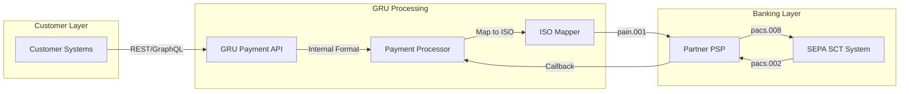
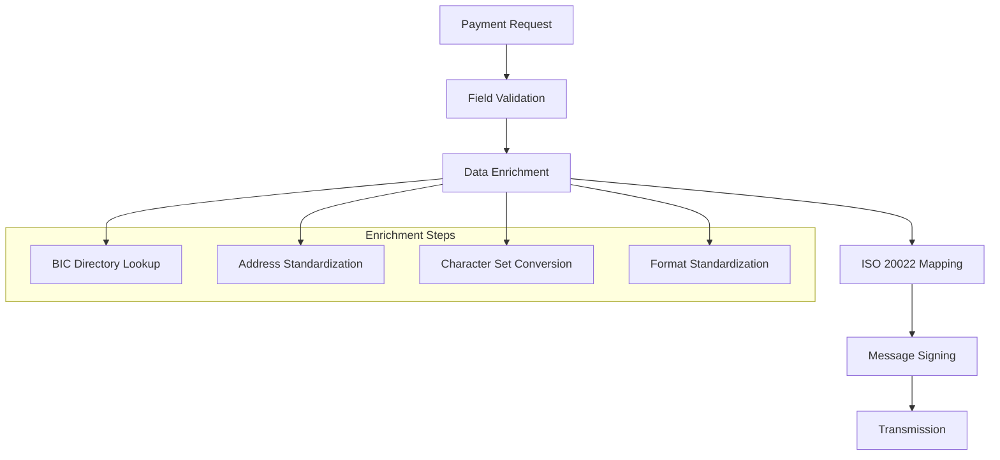

# ISO 20022 Message Mapping Table

## Executive Summary
This document provides comprehensive field-level mapping between GRU internal payment processing system and ISO 20022 messages for SEPA compliance, ensuring seamless integration with European payment infrastructure.

## 1. Message Overview and Usage

### 1.1 Supported Message Types

| ISO 20022 Message | Purpose | GRU Usage | Implementation Status |
|------------------|---------|-----------|---------------------|
| **pain.001.001.03** | Customer Credit Transfer Initiation | M1 EUR payment initiation | ✅ Production |
| **pacs.008.001.02** | FI to FI Customer Credit Transfer | Interbank settlement | ✅ Production |
| **pacs.002.001.03** | FI to FI Payment Status Report | Payment confirmation/rejection | ✅ Production |
| **camt.053.001.02** | Bank to Customer Statement | Account statements | 🔄 Testing |
| **camt.054.001.02** | Bank to Customer Debit/Credit Notification | Real-time notifications | 📋 Planned Q2 2025 |

### 1.2 Message Flow Architecture



## 2. pain.001 (Customer Credit Transfer Initiation) Mapping

### 2.1 Group Header (GrpHdr) Mapping

| ISO 20022 Element | GRU Internal Field | Validation Rules | Example Value |
|------------------|-------------------|------------------|---------------|
| **MsgId** | `payment_batch.message_id` | Unique per batch, max 35 chars | `GRU20251028141530001` |
| **CreDtTm** | `payment_batch.created_at` | ISO 8601 format | `2025-10-28T14:15:30.000Z` |
| **NbOfTxs** | `payment_batch.transaction_count` | Numeric, matches actual count | `1` |
| **CtrlSum** | `payment_batch.total_amount` | Decimal, sum of all amounts | `1000.00` |
| **InitgPty/Nm** | `customer.legal_name` | Max 70 chars, UTF-8 | `GRU Digital Bank` |
| **InitgPty/Id/OrgId/Othr/Id** | `customer.participant_id` | GRU internal identifier | `GRU001DBANK` |

### 2.2 Payment Information (PmtInf) Mapping

| ISO 20022 Element | GRU Internal Field | Validation Rules | Example Value |
|------------------|-------------------|------------------|---------------|
| **PmtInfId** | `payment_instruction.id` | Unique per instruction | `GRU-PMT-20251028-001` |
| **PmtMtd** | `payment_instruction.method` | Fixed value `TRF` | `TRF` |
| **SvcLvl/Cd** | `payment_instruction.service_level` | `SEPA` for EUR payments | `SEPA` |
| **LclInstrm/Cd** | `payment_instruction.local_instrument` | `INST` for instant, empty for standard | `INST` |
| **ReqdExctnDt** | `payment_instruction.execution_date` | ISO date format | `2025-10-28` |

### 2.3 Debtor Information Mapping

| ISO 20022 Element | GRU Internal Field | Validation Rules | Example Value |
|------------------|-------------------|------------------|---------------|
| **Dbtr/Nm** | `debtor.name` | Max 70 chars, mandatory | `GRU Institutional Client Corp` |
| **Dbtr/PstlAdr/Ctry** | `debtor.address.country` | ISO 3166-1 alpha-2 | `MT` |
| **DbtrAcct/Id/IBAN** | `debtor.account.iban` | IBAN validation | `MT84MALT012000000000000000123` |
| **DbtrAgt/FinInstnId/BIC** | `debtor.bank.bic` | BIC validation | `GRUUMTMT` |
| **UltmtDbtr/Nm** | `debtor.ultimate_name` | Max 70 chars, optional | `GRU Investment Holdings Ltd` |

### 2.4 Credit Transfer Transaction Information Mapping

| ISO 20022 Element | GRU Internal Field | Validation Rules | Example Value |
|------------------|-------------------|------------------|---------------|
| **EndToEndId** | `transaction.end_to_end_id` | Max 35 chars, unique per originator | `GRU-E2E-20251028-141530-001` |
| **TxId** | `transaction.id` | Max 35 chars, unique per PSP | `GRU-TXN-20251028-001` |
| **InstdAmt** | `transaction.instructed_amount` | Decimal with currency | `1000.00 EUR` |
| **CdtrAgt/FinInstnId/BIC** | `creditor.bank.bic` | BIC validation | `DEUTDEFF` |
| **Cdtr/Nm** | `creditor.name` | Max 70 chars, mandatory | `European Industrial Partners GmbH` |
| **CdtrAcct/Id/IBAN** | `creditor.account.iban` | IBAN validation | `DE89370400440532013000` |

## 3. pacs.008 (FI to FI Customer Credit Transfer) Mapping

### 3.1 Group Header Mapping

| ISO 20022 Element | GRU Internal Field | Transformation Logic | Example Value |
|------------------|-------------------|---------------------|---------------|
| **MsgId** | `interbank_message.id` | Generate unique FI-to-FI ID | `GRUUMTMT20251028141530001` |
| **CreDtTm** | `interbank_message.created_at` | Current timestamp | `2025-10-28T14:15:30.123Z` |
| **NbOfTxs** | `interbank_message.transaction_count` | Count of transactions | `1` |
| **TtlIntrBkSttlmAmt** | `interbank_message.settlement_amount` | Total settlement amount | `1000.00` |
| **IntrBkSttlmDt** | `interbank_message.settlement_date` | Settlement date | `2025-10-28` |

### 3.2 Transaction Information Mapping

| ISO 20022 Element | GRU Internal Field | Mapping Logic | Example Value |
|------------------|-------------------|---------------|---------------|
| **IntrBkSttlmAmt** | `transaction.settlement_amount` | Same as instructed amount | `1000.00` |
| **AccptncDtTm** | `transaction.acceptance_datetime` | Processing timestamp | `2025-10-28T14:15:45.000Z` |
| **InstgAgt/FinInstnId/BIC** | `processing.instructing_agent` | GRU BIC code | `GRUUMTMT` |
| **InstdAgt/FinInstnId/BIC** | `processing.instructed_agent` | Partner PSP BIC | `DEUTDEFF` |

## 4. Data Transformation and Validation Rules

### 4.1 Character Set and Encoding

```yaml
Character_Set_Rules:
  Encoding: "UTF-8"
  Allowed_Characters: "SEPA character set per EPC guidelines"
  
  Character_Replacements:
    "ä": "ae"
    "ö": "oe" 
    "ü": "ue"
    "ß": "ss"
    
  Special_Character_Handling:
    Diacritics: "Remove or replace with nearest ASCII equivalent"
    Currency_Symbols: "Remove if not EUR symbol"
    Control_Characters: "Strip all control characters"
```

### 4.2 Field Length Validation

| Field Type | Maximum Length | Validation Rule | Error Handling |
|------------|---------------|-----------------|----------------|
| **Name Fields** | 70 characters | Truncate with warning | Log truncation event |
| **Address Lines** | 70 characters each | Multiple line support | Concatenate if needed |
| **Identifier Fields** | 35 characters | Strict validation | Reject if exceeded |
| **Remittance Info** | 140 characters | Truncate gracefully | Preserve key information |

### 4.3 Amount and Currency Validation

```yaml
Amount_Validation:
  Currency_Code: "EUR (fixed for SEPA)"
  Decimal_Places: "Maximum 2 decimal places"
  Amount_Range:
    Minimum: "0.01"
    Maximum_SCT: "999999999.99"
    Maximum_SCT_Inst: "100000.00"
    
  Validation_Rules:
    - "No negative amounts"
    - "No zero amounts"
    - "Proper decimal formatting"
    - "Currency consistency across message"
```

## 5. Error Handling and Validation

### 5.1 Validation Error Codes

| Error Code | Description | Resolution | Example |
|------------|-------------|------------|---------|
| **VLD001** | Invalid IBAN format | Correct IBAN or reject | `Invalid check digits in IBAN` |
| **VLD002** | BIC validation failure | Verify BIC or use alternative | `BIC not found in directory` |
| **VLD003** | Character set violation | Clean or replace characters | `Invalid character in name field` |
| **VLD004** | Field length exceeded | Truncate or reject | `Name field exceeds 70 characters` |
| **VLD005** | Amount validation failure | Correct amount format | `Amount exceeds SCT Inst limit` |

### 5.2 Message Enrichment Process

#### Data Enhancement Pipeline


## 6. Performance and Monitoring

### 6.1 Processing Metrics

| Metric | Target | Measurement | Alert Threshold |
|--------|-------|-------------|-----------------|
| **Mapping Latency** | <50ms | Per message processing time | >100ms |
| **Validation Success Rate** | >99% | Successful validations/total | <95% |
| **Character Conversion Rate** | >99.9% | Successful conversions | <99% |
| **Message Size** | <2MB | Average message size | >5MB |

### 6.2 Quality Assurance

#### Testing Framework
```yaml
Test_Coverage:
  Unit_Tests:
    - Field_Mapping_Accuracy
    - Validation_Rule_Coverage
    - Character_Set_Conversion
    - Amount_Formatting
    
  Integration_Tests:
    - End_to_End_Message_Flow
    - Partner_PSP_Connectivity
    - Error_Handling_Scenarios
    - Performance_Load_Testing
    
  Compliance_Tests:
    - EPC_Rulebook_Conformance
    - ISO_20022_Schema_Validation
    - SEPA_Directory_Integration
```

## 7. Configuration and Maintenance

### 7.1 Configuration Management

| Configuration Item | Update Frequency | Source | Validation Required |
|-------------------|-----------------|--------|-------------------|
| **BIC Directory** | Daily | SWIFT/EPC | Automated validation |
| **Country Codes** | As needed | ISO 3166 | Manual verification |
| **Currency Codes** | As needed | ISO 4217 | Automated check |
| **Character Mapping** | Quarterly | Internal review | Testing required |

### 7.2 Version Control and Updates

#### Change Management Process
1. **Impact Assessment**: Evaluate changes against existing mappings
2. **Testing Phase**: Comprehensive testing in staging environment
3. **Stakeholder Review**: Business and technical validation
4. **Deployment**: Coordinated release with monitoring
5. **Validation**: Post-deployment verification and rollback capability

---

**Document Control:**
- **Version**: 1.0.0
- **Technical Owner**: Integration Team
- **Business Owner**: Payment Operations
- **Review Frequency**: Quarterly
- **Next Review**: January 2026