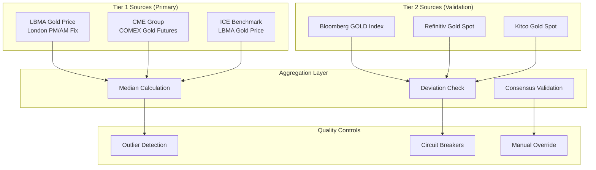
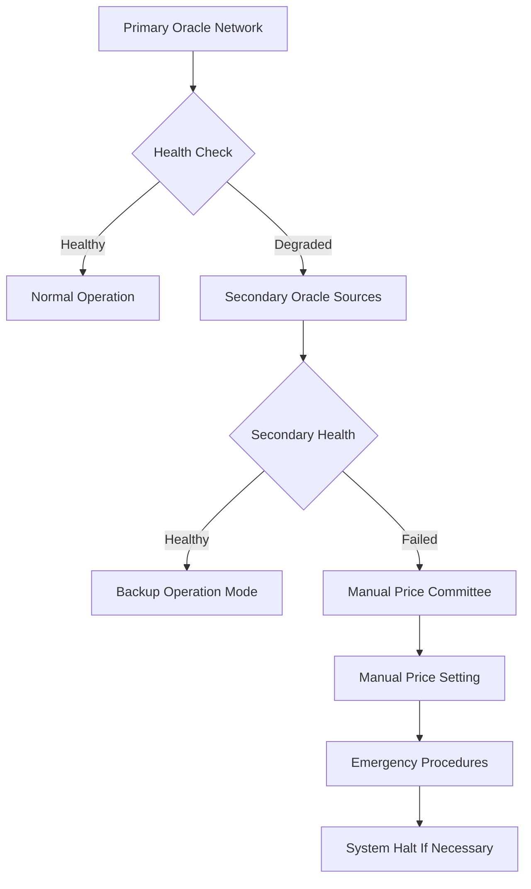

# Oracle Governance and Price Feed Risk Management Standard

## Executive Summary

This standard establishes comprehensive governance, risk management, and operational controls for oracle services and price feed mechanisms critical to GRU monetary operations, addressing manipulation risks, data integrity, and operational resilience requirements.

## 1. Oracle Risk Framework and Governance

### 1.1 Regulatory Context and Requirements

| Risk Area | Regulatory Basis | GRU Implementation |
|-----------|-----------------|-------------------|
| **Oracle Manipulation** | BIS Research on DeFi Oracle Risk | Multi-source aggregation with deviation controls |
| **Operational Resilience** | DORA ICT Risk Management | Redundant oracle infrastructure |
| **Data Quality** | MiCA Reserve Valuation Requirements | Independent validation and verification |
| **Market Integrity** | EU Market Abuse Regulation | Manipulation detection and reporting |

### 1.2 Oracle Governance Structure

#### Oracle Risk Committee
```yaml
Oracle_Risk_Committee:
  Composition:
    Chairman: "Chief Risk Officer"
    Members:
      - "Chief Technology Officer"
      - "Head of Treasury"
      - "Senior Quantitative Analyst"
      - "External Oracle Expert (Independent)"
    
  Responsibilities:
    - "Oracle strategy and policy approval"
    - "Risk appetite and tolerance setting"
    - "Vendor selection and performance review"
    - "Incident response and escalation"
    
  Meeting_Frequency: "Monthly (weekly during high volatility)"
  Reporting_Line: "Board Risk Committee"
```

## 2. Price Feed Architecture and Multi-Source Strategy

### 2.1 Primary Price Sources and Methodology

#### Gold Price Oracle Ecosystem


### 2.2 Oracle Selection Criteria and Due Diligence

#### Primary Oracle Provider Assessment Matrix
| Evaluation Criteria | Weight | Assessment Method | Minimum Standard |
|-------------------|--------|------------------|-----------------|
| **Data Accuracy** | 30% | Historical deviation analysis | <0.1% average deviation |
| **Reliability/Uptime** | 25% | SLA monitoring and verification | >99.95% uptime |
| **Security Standards** | 20% | Penetration testing, audits | ISO 27001 certification |
| **Regulatory Compliance** | 15% | Regulatory status review | Authorized/regulated entity |
| **Market Reputation** | 10% | Industry standing assessment | Established market presence |

#### Oracle Provider Portfolio
```yaml
Oracle_Provider_Ecosystem:
  Primary_Providers:
    LBMA_ICE_Benchmark:
      Role: "Authoritative gold price fixing"
      Weight: "40%"
      Update_Frequency: "Twice daily (AM/PM)"
      Backup: "Historical averaging"
      
    CME_Group_COMEX:
      Role: "Real-time futures pricing"
      Weight: "30%"
      Update_Frequency: "Continuous during trading hours"
      Backup: "Settlement price"
      
    Bloomberg_Terminal:
      Role: "Cross-validation and real-time data"
      Weight: "20%"
      Update_Frequency: "Real-time (1-second intervals)"
      Backup: "Delayed feed"
      
  Secondary_Providers:
    Refinitiv_Eikon:
      Role: "Alternative data validation"
      Usage: "Deviation detection and validation"
      
    Coinbase_Pro:
      Role: "Digital gold market reference"
      Usage: "Market sentiment and arbitrage detection"
```

## 3. Price Aggregation and Consensus Mechanisms

### 3.1 Multi-Source Aggregation Algorithm

#### Weighted Median Calculation
```python
def calculate_weighted_median_price(price_feeds, weights):
    """
    Calculate weighted median price from multiple oracle sources
    with outlier detection and deviation controls
    """
    
    # Step 1: Validate input data
    validated_feeds = validate_price_feeds(price_feeds)
    
    # Step 2: Outlier detection and filtering
    filtered_feeds = detect_and_filter_outliers(validated_feeds)
    
    # Step 3: Calculate weighted median
    weighted_median = compute_weighted_median(filtered_feeds, weights)
    
    # Step 4: Apply deviation limits
    final_price = apply_deviation_controls(weighted_median)
    
    # Step 5: Log and audit trail
    log_price_calculation(final_price, filtered_feeds, weights)
    
    return final_price

def detect_and_filter_outliers(price_feeds, z_score_threshold=2.5):
    """
    Detect and filter statistical outliers using z-score analysis
    """
    mean_price = calculate_mean(price_feeds)
    std_dev = calculate_standard_deviation(price_feeds)
    
    filtered_feeds = []
    for feed in price_feeds:
        z_score = abs((feed.price - mean_price) / std_dev)
        if z_score <= z_score_threshold:
            filtered_feeds.append(feed)
        else:
            log_outlier_detection(feed, z_score)
            
    return filtered_feeds
```

### 3.2 Deviation Controls and Circuit Breakers

#### Price Movement Thresholds and Controls
```yaml
Deviation_Control_Framework:
  Intra_Day_Limits:
    Warning_Threshold: "±2.5% from previous close"
    Circuit_Breaker_Level_1: "±5% from previous close"
    Circuit_Breaker_Level_2: "±10% from previous close"
    
  Inter_Source_Deviation:
    Normal_Range: "±0.5% between primary sources"
    Investigation_Trigger: "±1% between primary sources"
    Manual_Review_Required: "±2% between primary sources"
    
  Volatility_Controls:
    Daily_Volatility_Limit: "5% standard deviation"
    Weekly_Volatility_Alert: "15% standard deviation"
    
  Response_Actions:
    Warning_Level:
      - "Enhanced monitoring activation"
      - "Additional source validation"
      - "Risk committee notification"
      
    Circuit_Breaker_Level_1:
      - "Pause automated price updates"
      - "Manual price verification required"
      - "Stakeholder communication"
      
    Circuit_Breaker_Level_2:
      - "Full trading halt consideration"
      - "Emergency committee activation"
      - "Regulatory notification"
```

### 3.3 Heartbeat and Liveness Monitoring

#### Oracle Health Monitoring System
| Monitoring Metric | Normal Threshold | Warning Level | Critical Level |
|------------------|-----------------|---------------|----------------|
| **Data Freshness** | <60 seconds | 60-300 seconds | >300 seconds |
| **Source Availability** | 100% of primary sources | 2/3 primary sources | <2/3 primary sources |
| **Price Deviation** | <0.5% from consensus | 0.5-2% deviation | >2% deviation |
| **Update Frequency** | Per schedule | 10% delay | >20% delay |

#### Automated Health Checks
```yaml
Health_Check_System:
  Real_Time_Monitoring:
    Data_Feed_Status: "Continuous availability checking"
    Price_Validation: "Cross-source comparison every 30 seconds"
    Latency_Monitoring: "End-to-end latency measurement"
    
  Periodic_Validation:
    Daily_Reconciliation: "End-of-day price validation"
    Weekly_Performance_Review: "Source performance analysis"
    Monthly_Accuracy_Assessment: "Historical accuracy evaluation"
    
  Alert_System:
    Immediate_Alerts: "SMS + email for critical issues"
    Status_Dashboard: "Real-time health visualization"
    Escalation_Matrix: "Tiered response procedures"
```

## 4. Oracle Security and Anti-Manipulation Controls

### 4.1 Attack Vector Analysis and Mitigation

#### Common Oracle Attack Patterns
| Attack Type | Risk Level | Mitigation Strategy | Detection Method |
|-------------|------------|-------------------|-----------------|
| **Flash Loan Attacks** | High | Multi-block price averaging | Transaction pattern analysis |
| **Front-Running** | Medium | Commit-reveal schemes | MEV detection tools |
| **Data Feed Manipulation** | High | Multiple independent sources | Cross-validation algorithms |
| **Eclipse Attacks** | Medium | Diverse network topology | Network monitoring |
| **Governance Attacks** | Critical | Multi-signature controls | Voting pattern analysis |

#### Security Control Framework
```yaml
Security_Controls:
  Data_Integrity:
    Cryptographic_Signatures: "All price feeds digitally signed"
    Timestamp_Verification: "RFC 3161 compliant timestamps"
    Hash_Chain_Validation: "Sequential data integrity checks"
    
  Access_Controls:
    Multi_Signature_Requirements: "3-of-5 for critical updates"
    Role_Based_Permissions: "Least privilege access model"
    Hardware_Security_Modules: "Key storage and signing"
    
  Network_Security:
    VPN_Connections: "Encrypted data transmission"
    API_Rate_Limiting: "DDoS protection measures"
    Geographic_Redundancy: "Multiple data centers"
```

### 4.2 Manipulation Detection and Response

#### Real-Time Manipulation Detection
```yaml
Manipulation_Detection_System:
  Statistical_Analysis:
    Benford_Law_Testing: "First-digit frequency analysis"
    Autocorrelation_Testing: "Time series correlation analysis"
    Volatility_Clustering: "GARCH model-based detection"
    
  Pattern_Recognition:
    Unusual_Trading_Volumes: "Volume-price relationship analysis"
    Temporal_Patterns: "Time-of-day manipulation detection"
    Cross_Market_Analysis: "Multi-venue price comparison"
    
  Machine_Learning_Models:
    Anomaly_Detection: "Unsupervised learning algorithms"
    Behavioral_Analysis: "Normal vs. abnormal pattern recognition"
    Ensemble_Methods: "Multiple model consensus"
```

#### Incident Response Procedures
| Detection Level | Response Time | Actions Required | Escalation |
|----------------|---------------|------------------|------------|
| **Suspicious Activity** | 5 minutes | Enhanced monitoring, data collection | Operations team |
| **Probable Manipulation** | 15 minutes | Price feed suspension, investigation | Risk committee |
| **Confirmed Manipulation** | 30 minutes | Emergency procedures, regulatory notification | Board + regulators |

## 5. Oracle Economics and Incentive Alignment

### 5.1 Oracle Provider Incentive Structure

#### Performance-Based Compensation Model
```yaml
Oracle_Compensation_Framework:
  Base_Fee_Structure:
    Fixed_Monthly_Fee: "Baseline service provision"
    Volume_Based_Component: "Scaled with usage"
    Performance_Bonuses: "Accuracy and reliability rewards"
    
  Performance_Metrics:
    Accuracy_Score: "Weighted by deviation from consensus"
    Reliability_Score: "Uptime and response time based"
    Security_Score: "Incident-free operation rewards"
    
  Penalty_Structure:
    Minor_Deviations: "Fee reduction (5-10%)"
    Major_Incidents: "Substantial penalties (25-50%)"
    Service_Termination: "Breach of contract consequences"
```

### 5.2 Slashing and Penalty Mechanisms

#### Decentralized Oracle Slashing Conditions
```yaml
Slashing_Conditions:
  Accuracy_Violations:
    Threshold: "Price deviation >3% from consensus"
    Penalty: "10% of staked tokens"
    Escalation: "Repeated violations increase penalty"
    
  Availability_Violations:
    Threshold: "Uptime <99% over 30-day period"
    Penalty: "5% of staked tokens"
    Grace_Period: "24-hour notification period"
    
  Security_Violations:
    Threshold: "Compromised keys or data feeds"
    Penalty: "50-100% of staked tokens"
    Immediate_Action: "Immediate suspension from network"
```

## 6. Fallback Mechanisms and Manual Override Procedures

### 6.1 Emergency Fallback Systems

#### Fallback Hierarchy and Procedures


#### Fallback Trigger Conditions
| Trigger Condition | Automatic Response | Manual Intervention Required |
|------------------|------------------|---------------------------|
| **Single Source Failure** | Switch to remaining sources | Monitor and investigate |
| **Majority Source Failure** | Activate backup sources | Emergency committee meeting |
| **Complete Oracle Failure** | Manual override protocol | Board emergency session |
| **Suspected Manipulation** | Immediate price freeze | Forensic investigation |

### 6.2 Manual Override and Committee Procedures

#### Emergency Price Committee
```yaml
Emergency_Price_Committee:
  Composition:
    - "Chief Risk Officer (Chairman)"
    - "Head of Treasury" 
    - "Senior Quantitative Analyst"
    - "External Market Expert"
    - "Independent Board Member"
    
  Activation_Criteria:
    - "Complete oracle system failure >30 minutes"
    - "Suspected large-scale manipulation"
    - "Extreme market conditions (>10% intraday volatility)"
    - "Regulatory intervention required"
    
  Decision_Process:
    Quorum: "Minimum 3 members"
    Consensus: "Majority vote required"
    Documentation: "All decisions recorded and audited"
    Review: "Post-incident analysis mandatory"
    
  Override_Authorities:
    Price_Setting: "Temporary manual price fixes"
    System_Halt: "Trading suspension authority"
    Communication: "Public disclosure coordination"
```

## 7. Testing and Validation Framework

### 7.1 Oracle System Testing Program

#### Testing Methodology and Schedule
| Test Type | Frequency | Scope | Success Criteria |
|-----------|-----------|-------|-----------------|
| **Unit Testing** | Continuous | Individual components | 100% test coverage |
| **Integration Testing** | Weekly | End-to-end workflows | All scenarios pass |
| **Stress Testing** | Monthly | High load conditions | System stability maintained |
| **Chaos Engineering** | Quarterly | Failure simulation | Graceful degradation |
| **Penetration Testing** | Semi-annually | Security assessment | No critical vulnerabilities |

#### Test Scenarios and Simulations
```yaml
Test_Scenario_Library:
  Normal_Operations:
    - "Standard price feed processing"
    - "Cross-validation and consensus"
    - "Historical data comparison"
    
  Failure_Scenarios:
    - "Single oracle source failure"
    - "Network connectivity issues"
    - "Data corruption or invalid feeds"
    
  Attack_Simulations:
    - "Flash loan manipulation attempts"
    - "Eclipse attack simulation"
    - "Data feed compromise scenarios"
    
  Extreme_Market_Conditions:
    - "High volatility periods"
    - "Market crash simulations"  
    - "Liquidity crisis scenarios"
```

## 8. Monitoring, Alerting, and Incident Management

### 8.1 Comprehensive Monitoring Framework

#### Key Performance Indicators (KPIs)
```yaml
Oracle_KPIs:
  Accuracy_Metrics:
    Mean_Absolute_Deviation: "<0.1% from benchmark"
    Maximum_Deviation: "<0.5% for any single reading"
    Consensus_Rate: ">95% agreement between sources"
    
  Reliability_Metrics:
    System_Uptime: ">99.95%"
    Data_Freshness: "<60 seconds average"
    Response_Time: "<500ms for API calls"
    
  Security_Metrics:
    Failed_Authentication_Rate: "<0.1%"
    Anomaly_Detection_Rate: "Baseline establishment"
    Incident_Response_Time: "<15 minutes"
```

### 8.2 Incident Classification and Response

#### Incident Severity Matrix
| Severity | Impact Description | Response Time | Escalation Level |
|----------|-------------------|---------------|------------------|
| **P1 - Critical** | Complete oracle system failure | 5 minutes | Board notification |
| **P2 - High** | Partial system degradation | 15 minutes | Executive team |
| **P3 - Medium** | Single source failure or deviation | 30 minutes | Operations team |
| **P4 - Low** | Minor performance issues | 2 hours | Technical team |

## 9. Audit Trail and Compliance Documentation

### 9.1 Comprehensive Audit Trail Requirements

#### Data Retention and Logging
```yaml
Audit_Trail_Framework:
  Price_Data_Retention:
    Real_Time_Data: "7 years"
    Aggregated_Data: "Permanent retention"
    Calculation_Logs: "10 years"
    
  System_Logs:
    Access_Logs: "All API and system access"
    Error_Logs: "All system errors and exceptions"
    Configuration_Changes: "All parameter modifications"
    
  Decision_Audit_Trail:
    Committee_Decisions: "All manual overrides and decisions"
    Risk_Assessments: "Periodic risk evaluation documentation"
    Incident_Reports: "Complete incident documentation"
```

### 9.2 Regulatory Reporting and Compliance

#### Regulatory Reporting Schedule
| Report Type | Frequency | Recipients | Content |
|-------------|-----------|------------|---------|
| **Oracle Health Report** | Monthly | Internal risk committee | System performance metrics |
| **Price Accuracy Report** | Quarterly | Board + regulators | Accuracy and deviation analysis |
| **Incident Summary Report** | Quarterly | Regulators | All incidents and resolutions |
| **Annual Oracle Assessment** | Annually | Board + regulators | Comprehensive system review |

---

**Document Control:**
- **Version**: 1.0.0
- **Approved by**: Board Risk Committee, Oracle Risk Committee
- **Classification**: Restricted - Risk Management Personnel Only
- **Next Review**: Semi-annually
- **Distribution**: Risk committee, technical leadership, external auditors